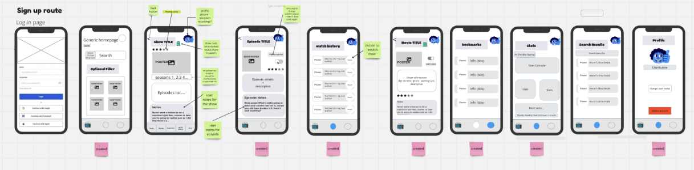

# WannaWatch - Film & TV Show Tracker

>Is an Android application that allows the user to track and analyze their watched movies & TV shows.  
It provides a user intuitive way to search for new movies or TV shows to watch and to add them to their list.  
The statistic section of the application provides a way to view the user's watching habits.

## Features
- **User Authentication**
- **Movie & TV Show Search**
- **Saving Movies & TV Shows to Bookmarked, Watching and Watched Lists**
- **Seeing Episodes for Saved Shows and checking watch progress**
- **Watched Movie, Watched & Watching Show Statistics**

## Planned Features
- **Searching and adding shows** Newly added
- **Chat functionality to chat with friends about there favorite Media.**
- **Recommendation algorithm and friend recommendations**
- **Rating and adding notes to individual episodes**

## Used Technologies

- Data from [TMDB API](https://developer.themoviedb.org/reference/intro/getting-started)
- Theming done using [Material Design Components](https://m2.material.io/develop/android)

### Back End

- [Spring Boot](https://spring.io/projects/spring-boot):  
	*Is a open-source tool to make it easier to manage Java-based frameworks such as:  
	**Security**, **in app h2 database**, **lombok**, ...*  
- [Hibernate](https://hibernate.org/):  
	*Is an object–relational mapping tool for the Java programming language. It provides a framework for mapping an object-oriented domain model to a relational database.*  
- [PostgreSQL](https://www.postgresql.org/):  
	*Stores the user and movie data in a local "relational database".*
- [Firebase](https://firebase.google.com/):  
	*To authenticate users through there google account.*  
- [TMDB](https://developer.themoviedb.org/docs/getting-started):  
	*Movie database api to get the movie information.*

### Front End
- [Retrofit](https://square.github.io/retrofit/):  
	*Fetches data from the web service and routes it through a separate converter library that knows how to decode the data and return it in the form of objects, like String.*
- [Glide](https://github.com/bumptech/glide):  
	*To efficient load the movie poster based on there URL.*
- [AnyChart](https://api.anychart.com/):  
	*Is a lightweight and robust JavaScript charting solution with great API and documentation.*

### Development Tools
- [Intellij](https://www.jetbrains.com/idea/), [Android Studio](https://developer.android.com/studio?gad_source=1&gclid=Cj0KCQiAqL28BhCrARIsACYJvkeajXHrUFLVoYCmCsDx4ke0d93mJEfzl0jC_2y979G7CwoWN_Ub_F4aAo8qEALw_wcB&gclsrc=aw.ds&authuser=1):  
	*IDEs to write the code Java code for the back and front end.*
- [pgAdmin](https://www.pgadmin.org/):  
	*Is a graphical user interface (GUI) tool for managing PostgreSQL and other relational databases.*
- [Excalidraw](https://excalidraw.com/), [Miro](https://miro.com/), [Figma](https://www.figma.com/):  
	*To visualize and share ideas.*
- [Git](https://git-scm.com/), [GitHub](https://github.com/):  
	*To organize and collaborate on the projects code base.*

- [Slack](https://slack.com/intl/en-gb), [Zoom](https://www.zoom.com/):  
	*Stand ups and team meetings.*
--- 

## Achitecture

### Entity Relationship Diagram
*The relation of the tables and there data to each other in the postgres database.*

### Wireframe
*This wireframe was used to sketch out the lock of the Android application.*

